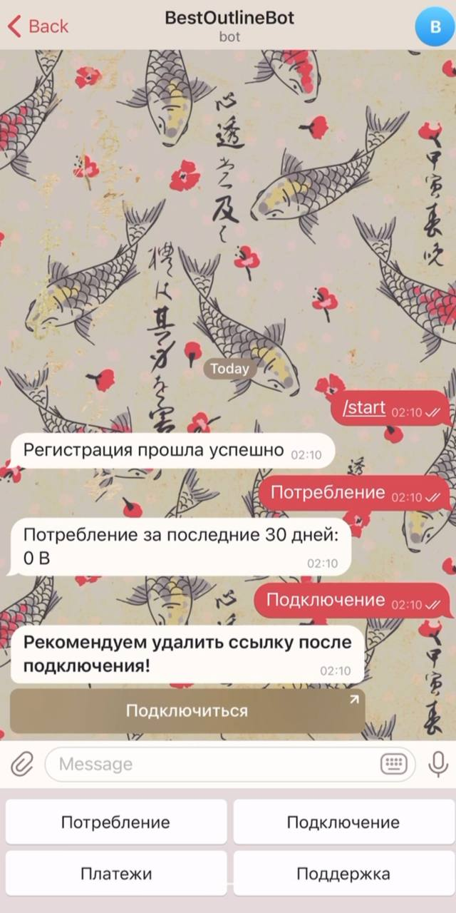

# Outline Bot
Telegram bot for your Outline server

## Client


## Server:
Export Telegram bot token and Outline management API URL to environment
```
export TGTOKEN=<tbot token>
export OUTLINEAPI=<management API URL>
```
Run server
```
>> outlinebot run
```
Give admin rights by Telegram user ID
```
>> outlinebot admin -u <user_id>
```
Deprive admin rights by Telegram user ID
```
>> outlinebot admin -u <user_id> -d
```