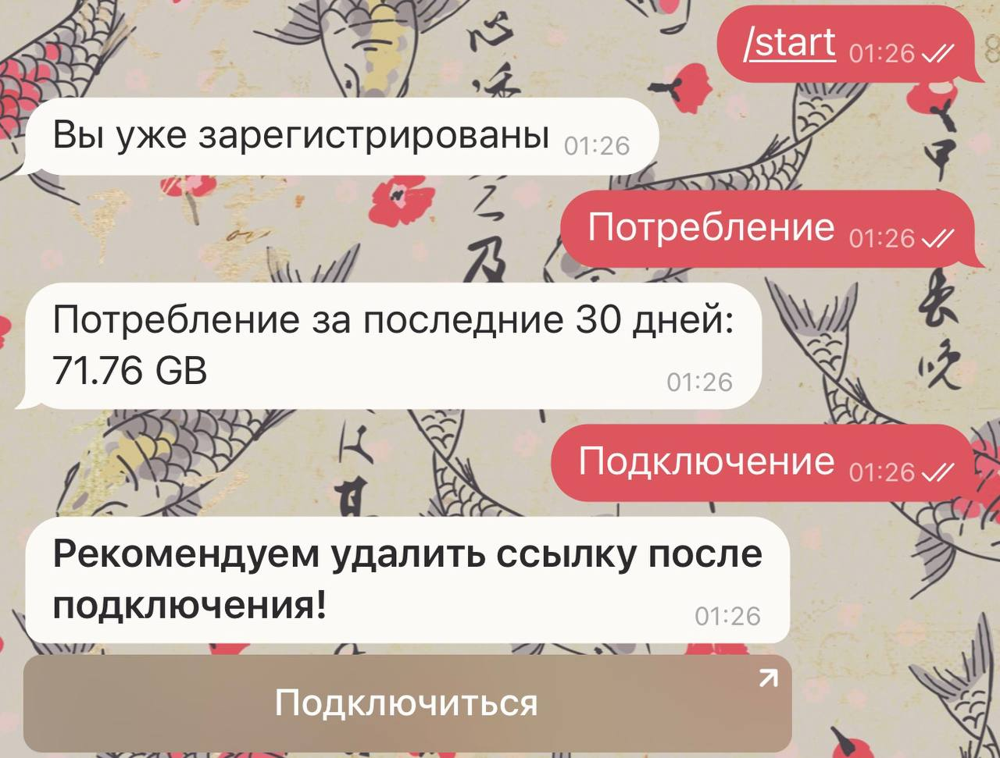
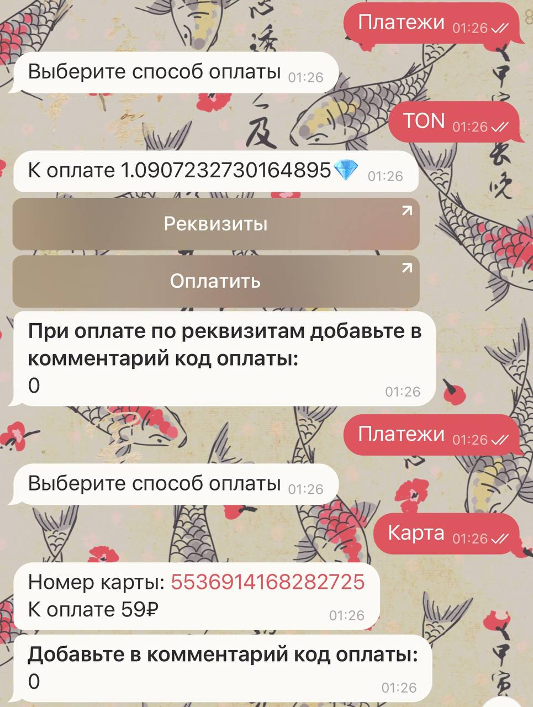
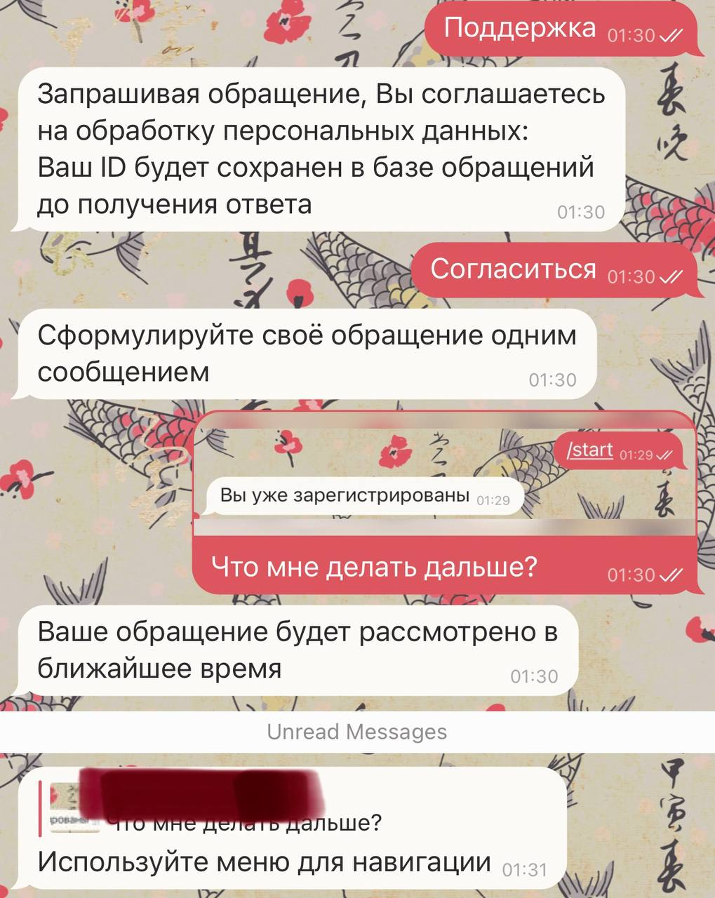
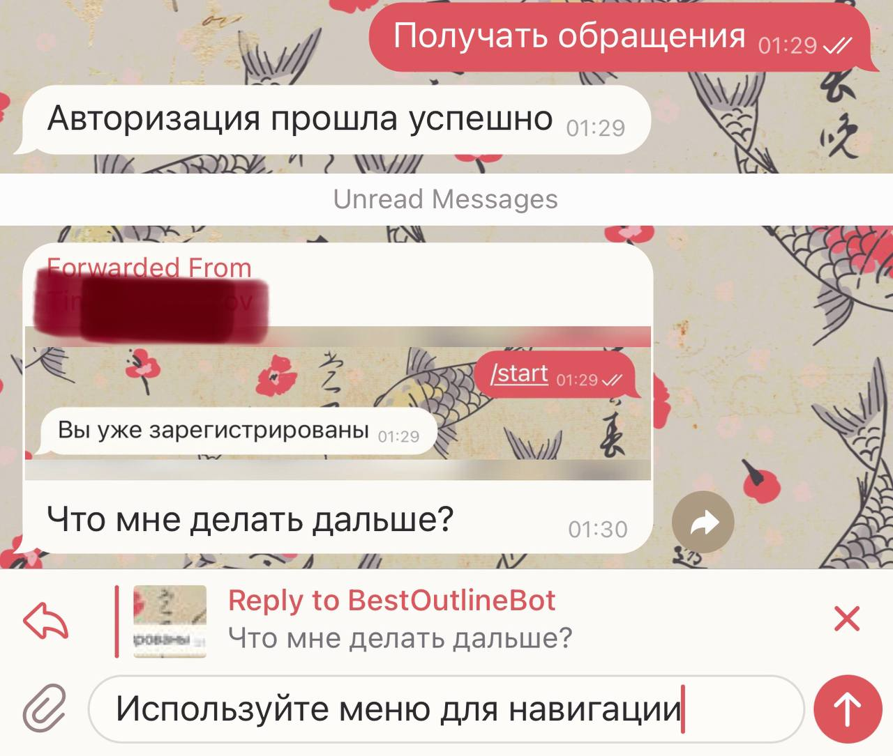
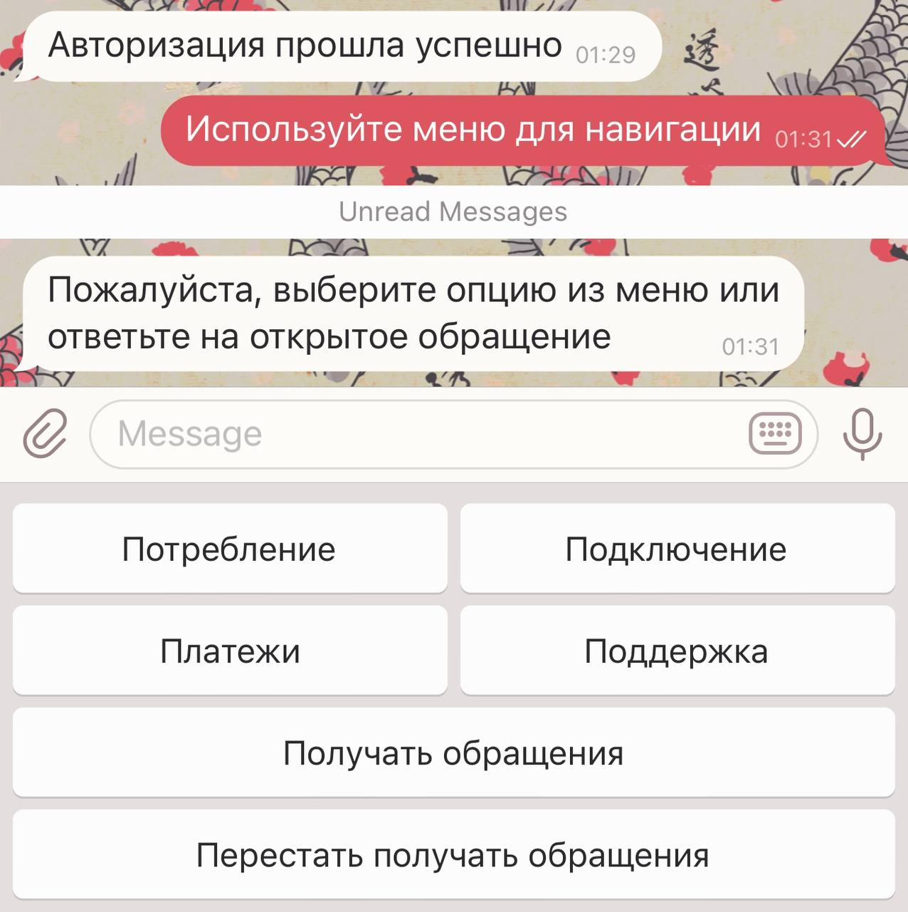

# Outline Bot
Telegram bot for your Outline server

## Client
<row>
    
    
    
</row>

## Admin
<row>
    
    
</row>

## Server:
Export `Telegram bot token`, `Outline management API URL`, `card number`, `tonnames url` to environment
```
export TGTOKEN=<tbot token>
export OUTLINEAPI=<management API URL>
export CARD=<card number>
export TON=<tonnames url>
```
Run server
```
>> outlinebot run
```
Give admin rights by Telegram user ID
```
>> outlinebot admin -u <user_id>
```
Deprive admin rights by Telegram user ID
```
>> outlinebot admin -u <user_id> -d
```